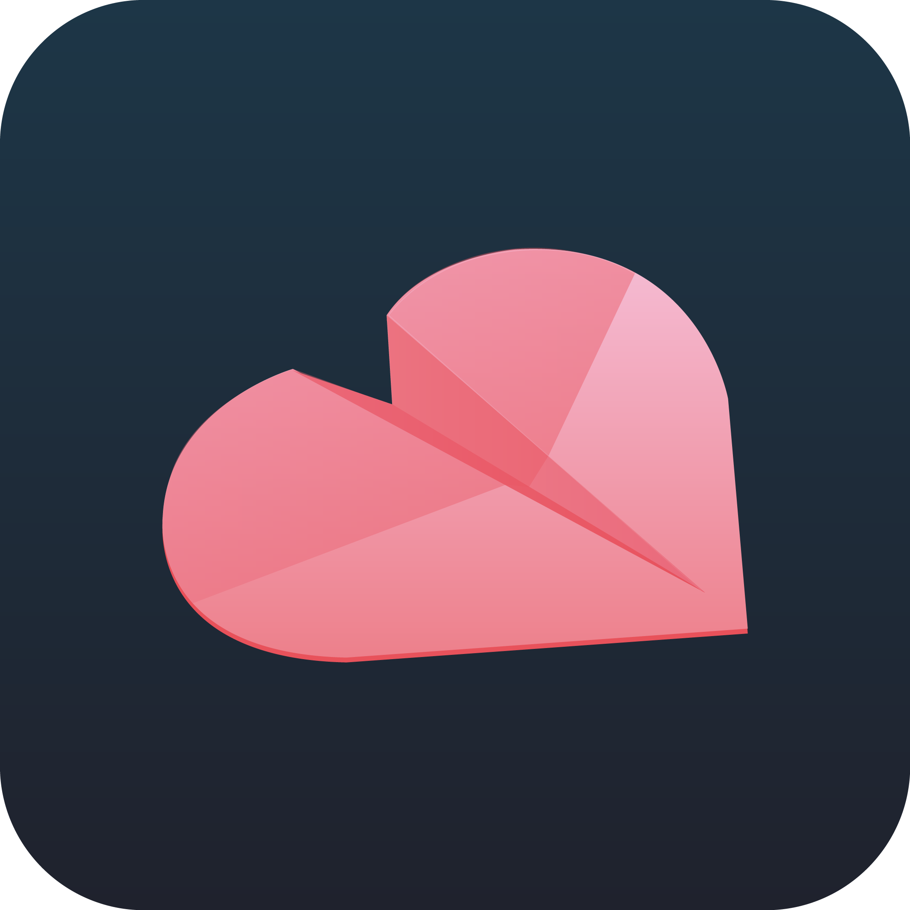
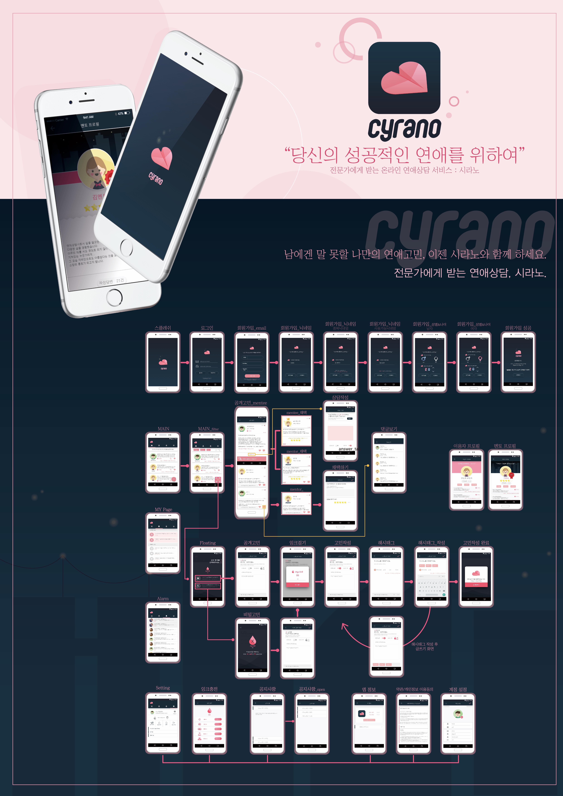

# # Cyrano

연애고민에 특화된 전문적인 상담을 보다 쉽게 서비스하기 위해 기획한 애플리케이션.
Blog : <https://godpp.github.io/2017/08/08/Cyrano%20IOS%20App/>

## # 개요

유저들간 연애고민에 대해 이야기를 나누고 공감을 하는 간단한 커뮤니티를 뛰어넘어,
연애 상담 경험과 지식이 많은 전문가에게 상담을 받아 신뢰성 높은 연애고민상담이 이루어지는 연애 관련 애플리케이션.

## # 주요기능

* 메인화면
  - 이용자들이 등록한 상담글을 모아 볼 수 있습니다. (비밀글 제외)
  - Pull Down 제스처를 통해 상담글을 Reload 할 수 있습니다.
  - 우측 하단 + 플로팅 버튼을 통해 고민을 작성 할 수 있습니다.
  
  ```
        //TabBar tint 값 제거 및 이미지 적용
        UITabBar.appearance().barTintColor = UIColor.init(red: 27/255.0, green: 43/255.0, blue: 56/255.0, alpha: 0.0)
        
        
        var tabBar = self.tabBar
        var homeImage = UIImage(named:"tab_home_selection_last")?.withRenderingMode(.alwaysOriginal)
        var mypageImg = UIImage(named: "tab_mypage_selection_last")?.withRenderingMode(.alwaysOriginal)
        var notificationImg = UIImage(named: "tab_alram_selection_last")?.withRenderingMode(.alwaysOriginal)
        var settingImg = UIImage(named: "tab_setting_selection_last")?.withRenderingMode(.alwaysOriginal)
        
        (tabBar.items![0] as! UITabBarItem).selectedImage = homeImage
        (tabBar.items![1] as! UITabBarItem).selectedImage = mypageImg
        (tabBar.items![2] as! UITabBarItem).selectedImage = notificationImg
        (tabBar.items![3] as! UITabBarItem).selectedImage = settingImg
  ```
  
* 공개 & 비밀 고민 작성
  - 이용자들끼리 이야기를 나누고 답변 할 수 있는 공개 고민 작성 (기본 잉크 10)
  - 연애 칼럼 리스트에게 문의 할 수 있는 비밀 고민 작성 (기본 잉크 300)
  - 개인정보 비밀, 사용 잉크량 조절이 가능하다.
  
* 상세 고민
  - 상단에 고민글과 하단에 답변글을 한번에 볼 수 있습니다.
  - 멘토, 채택 답변, 일반 답변에 따라 UI가 변경됩니다.

* 내가 쓴 상담
  - 이전에 작성했던 상담과 현재 등록한 자신의 상담을 볼 수 있습니다.
  
* 설정
  - 프로필 사진, 닉네임, 상태메시지 수정이 가능합니다.
  - 앱 내 결제를 통해 잉크를 구매할 수 있습니다.
  - 로그아웃이 가능합니다.
  
## # 워크플로우


